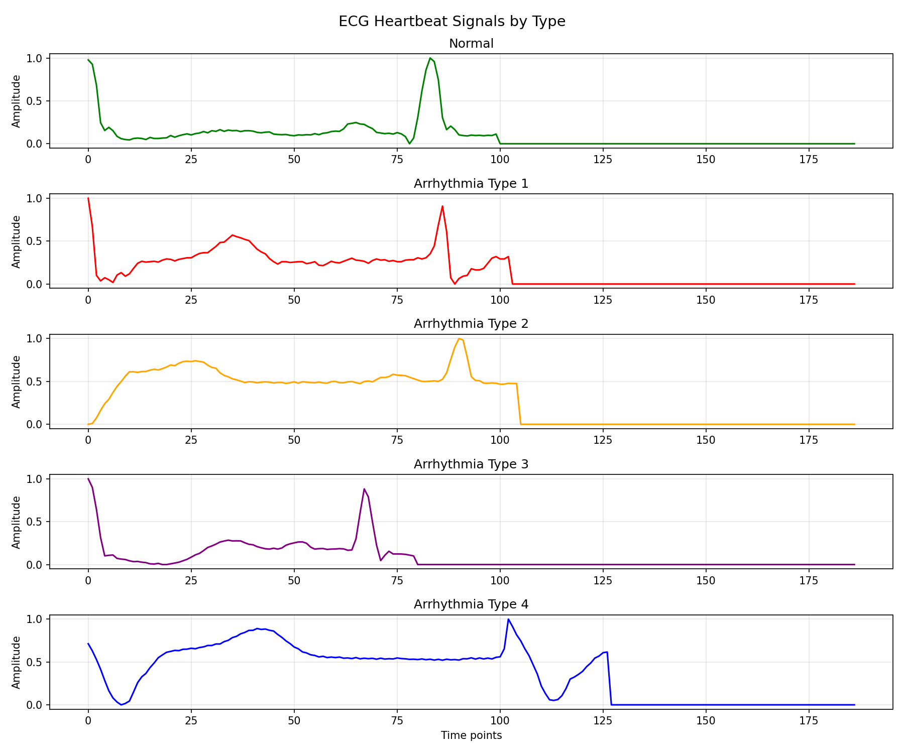
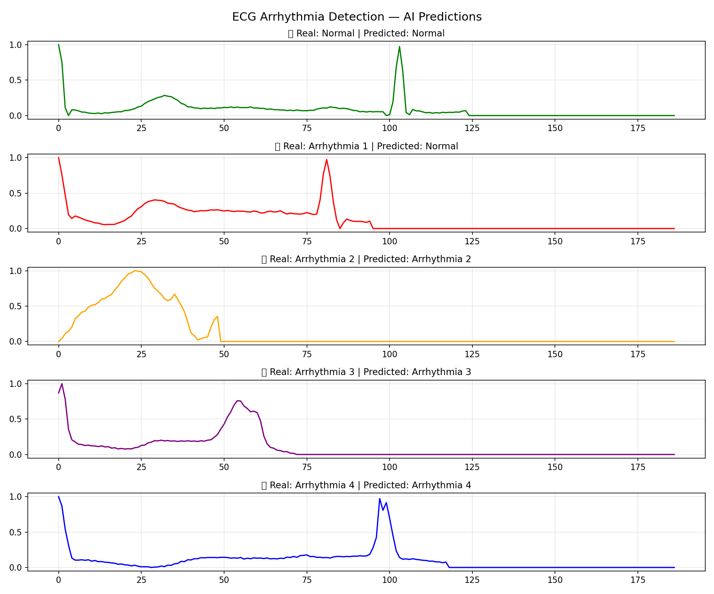
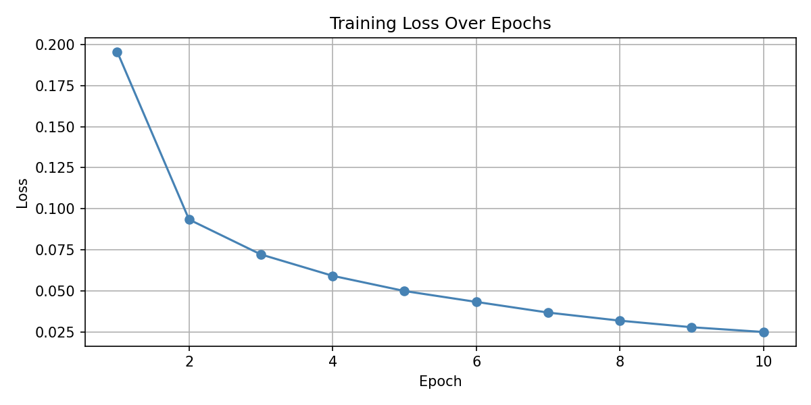

# 🫀 ECG Arrhythmia Detection with Deep Learning

Automatically detecting heart arrhythmias from ECG signals using a 1D CNN
trained on the MIT-BIH dataset.

## What this project does
Takes a heartbeat ECG signal as input and classifies it into 5 categories:
Normal or one of 4 types of arrhythmia — mimicking what a cardiologist does.

## Dataset
MIT-BIH Arrhythmia Dataset — 87,554 heartbeat signals, each with 187 time points.
5 classes: Normal, and 4 arrhythmia types.

## Model
1D Convolutional Neural Network (CNN) built with PyTorch.
- Training samples: 87,554
- Epochs: 10
- Final loss: 0.0249
- **Test Accuracy: 98.57%**

## Results
| | |
|---|---|
| ECG Signal Types | AI Predictions |
|  |  |

## Loss Curve

## Limitations & Next Steps
- Training for more epochs would improve arrhythmia type 1 detection
- Next: test on real-time ECG streams
- Next: try Transformer-based models for time series

## How to run
Open the notebook in Google Colab:
1. Upload your kaggle.json
2. Run all cells in order

## Tools used
Python · PyTorch · NumPy · Pandas · Matplotlib
